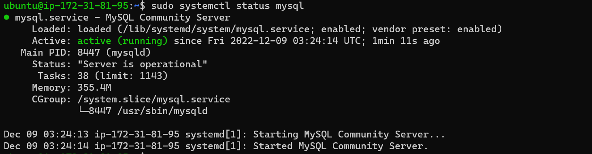
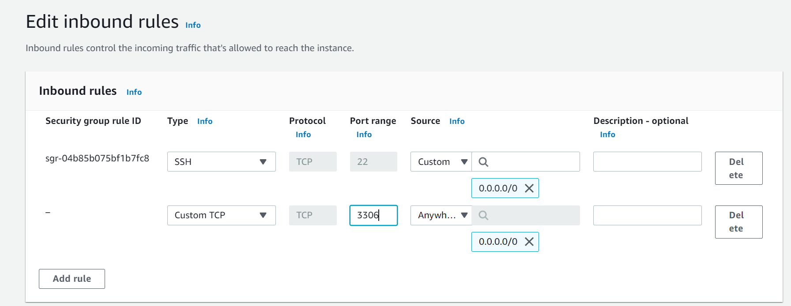
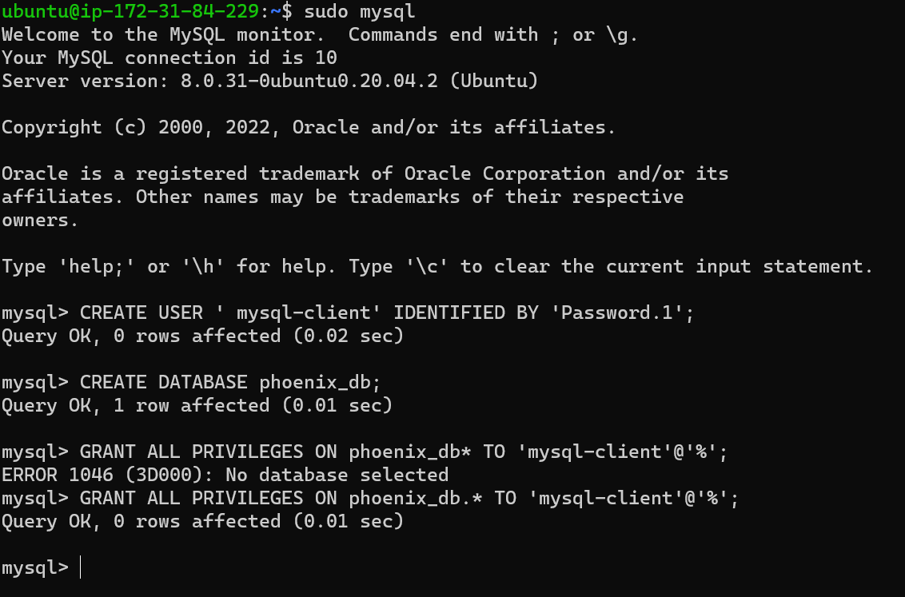
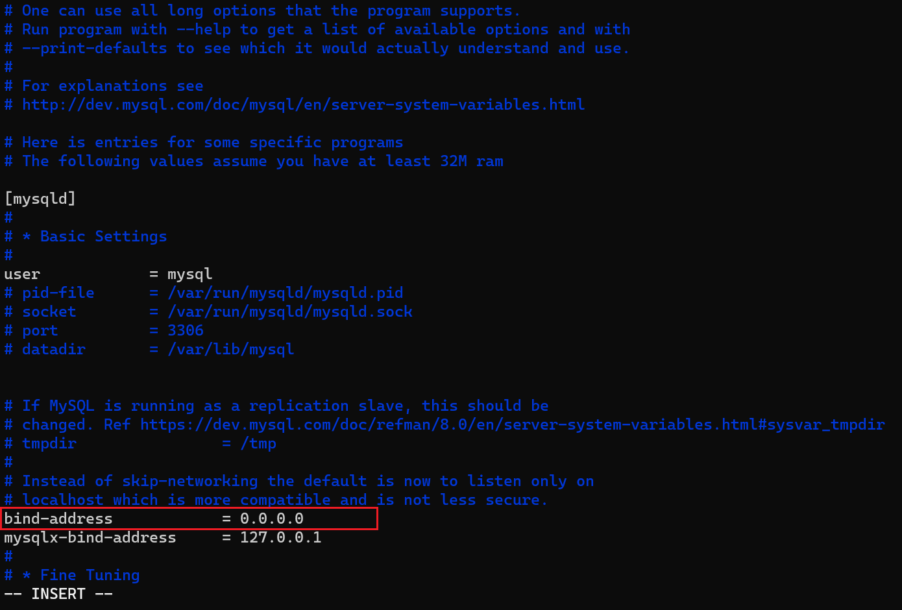
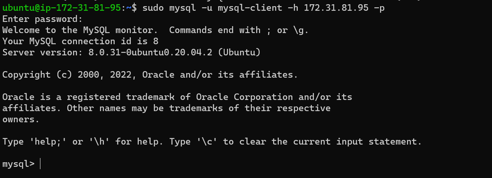
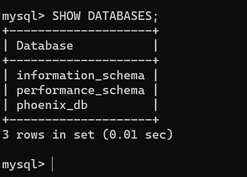

## Client-Server Architecture with MySQL
The following demonstrates a quick example of a basic client-Server communication - using MySQL Database Management System (DBMS).

### STEP 1 -Create and configure two Linux-based virtual servers (EC2 instances in AWS).
I'd be naming them;

*Server A name*- "mysql-server"
*Server B name* - "mysql-client"

### STEP2 -Install MySQL Server sofware on "mysql-server"

Update Ubuntu

`$ sudo apt update`

Upgrade Ubuntu

`$ sudo apt upgrade`

Install MySQL Server software
   
`sudo apt install mysql-server`

After the installation, you can check if to see if the mysqld (mysql daemon) is running. 

`sudo systemctl status mysql`

You should see something like this



### STEP 3 -Install the Mysql client package on "mysql-client"

`sudo apt install mysql-client`

After the installation process you can check the version and also see if the mysql is running as a process.

`$ mysql --version`
```
Output

mysql  Ver 8.0.31-0ubuntu0.20.04.2 for Linux on x86_64 ((Ubuntu))
```
`$ ps aux | grep mysql`
```
Output

ubuntu      7999  0.0  0.0   8168   720 pts/0    S+   03:32   0:00 grep --color=auto mysql
```
>The Ubuntu mysql-client package includes following command line tools (and more):

- mysql - the mysql command-line client to run SQL statements.
- mysqladmin - client for administering a MySQL server.
- mysqldump - a database backup program. The mysqldump command writes the contents of database tables into text files which you can use to restore databases.
- mysqlreport - Makes a friendly report of important MySQL status values.
- mysqlcheck - a command line client to check, repair, and optimize tables.

### STEP 4 -Open TCP port 3306 on "mysql-server"
By default MySQL server uses TCP port 3306. Now, we'd use mysql server's local IP address to connect from mysql client. Which means so to creat a new  ‘Inbound rules’ in "mysql-server". 



### STEP 5 -secure the "mysql-server" 

`sudo mysql_secure_installation`

You can mostly answer "y" for the subsequent prompts. 

### STEP 6 -Create a user and a db, and grant the new user every privilege to the newly created db

login to your mysql server with:

`sudo mysql`

`CREATE USER ' mysql-client' IDENTIFIED BY 'Pas*****1';`

`mysql> CREATE DATABASE phoenix_db;`

`mysql> GRANT ALL PRIVILEGES ON phoenix_db.* TO 'mysql-client'@'%';`


### STEP 6 -Configure MySQL server to allow connections from remote hosts.
   
`sudo vi /etc/mysql/mysql.conf.d/mysqld.cnf `

In the configuration file. replace ‘127.0.0.1’ to ‘0.0.0.0’ like this:



Do well to restart the mysql server after this adjustment

`sudo systemctl restart mysql`

### STEP 6 -Connect mysql client  remotely to mysql server Database Engine, without using SSH. but with the mysql utility.

`$ sudo mysql -u <mysqlusername> -h <host ip address> -p`

You should see something like this:



 **Now you're finally connected to your server from your client. You can run some basic command and bask in your success!**

 `mysql> SHOW DATABASES;`

 

 Congratulations! As you've just successfully deloyed a fully functional MySQL Client-Server setup.✨Yippee!✨


